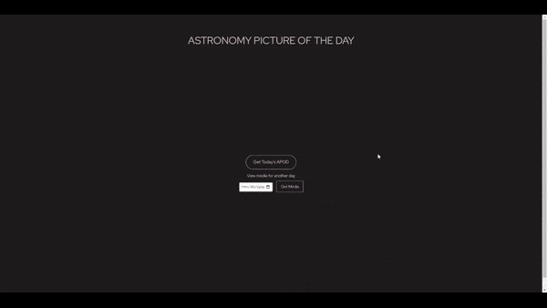
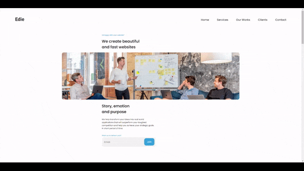
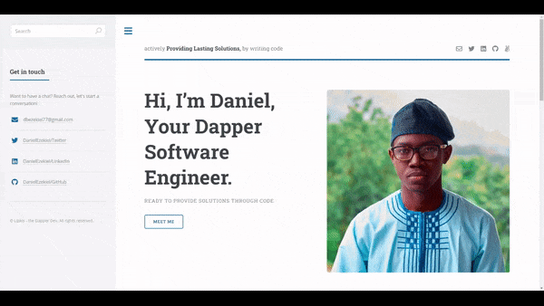
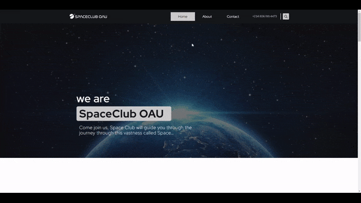

  
  
  
  
  

I am a solution-driven developer, passionate about making my mark and contributing to advances within the tech industry. I passionately and effectively implement my skills in solving problems and also look dapper while I'm at it. With a background in Engineering, Physics, and Math, my driving force is the proper use of the power of technology as a tool for positive change.

See [my website](https://danielezekiel.netlify.app) for more information!

<h1 align="center">Projects</h1>
<table bordercolor="#66b2b2">
  
  <tr>
    <td width="50%" valign="top">
      <h3 align="center">SC-OAU StarGazers APOD</h3>
         
        
         
        

          
    
  
      

        
<strong>HTML5, CSS & JavaScript</strong> - Platform to help space enthusiasts learn and improve their knowledge on space related occurences while having fun. The SC-APOD makesthe Space Involvement Dreams a Reality!

    </td>
    <td width="50%" valign="top">
      <h3 align="center">Edie Agency</h3>
         
      
         
        

          
  
  
      

        
<strong>HTML5, CSS & JavaScript</strong> - This agency website superbly combines structure, styling and behaviour to create a website which easily caters to the needs of individuals who require website solutions.

    </td>
  </tr>
  
  <tr>
    <td width="50%" valign="top">
      <h3 align="center">DanielEzekiel.com</h3>
       
        
       
        

  
  
      

        
<strong>HTML5, CSS3, & Javascript</strong> - Portfolio Site including links to my projects and ways to get in contact with me.

    </td>
    <td width="50%" valign="top">
      <h3 align="center">Space Club OAU</h3>
         
        
         
        

          
  
      

        
<strong>WordPress, PHP, HTML5 & CSS3</strong> - Want to join a community ready to help you improve your STEM capacity and dive into the deep mysteries within Space. Space CLub OAU is that community, a non-profit geared towards empowering individuals and enthusiasts with knowledge about space.

    </td>
  </tr>
</table>

<h1 align="center">Technologies</h1>

    
    
    
    
    
    
    
    
    
    

---

<h1 align="center">Connect</h1>

  
  
  
  
  

&nbsp;

